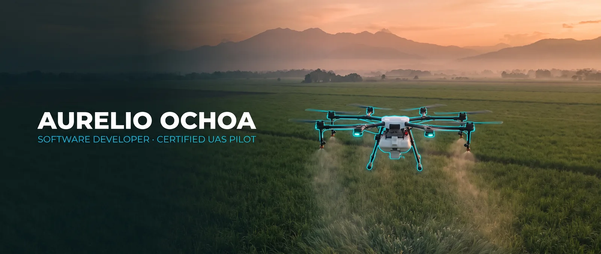
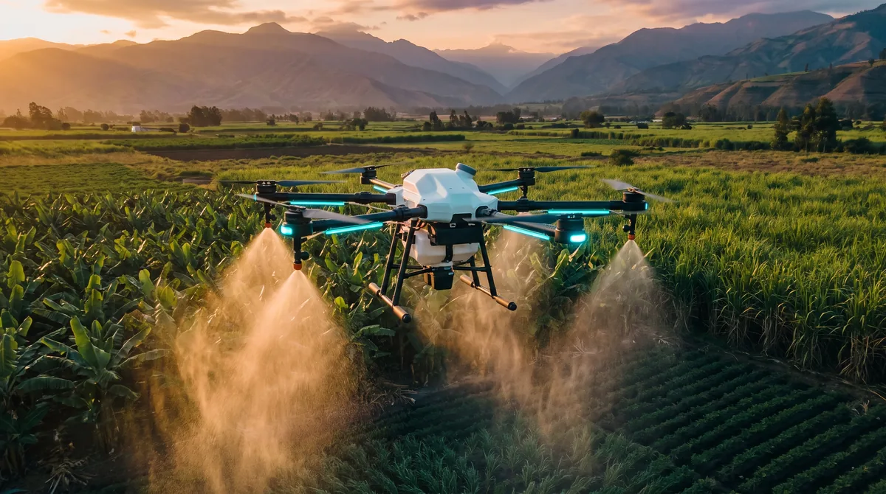

**[🇬🇧 English](#-english) · [🇪🇸 Español](#-español)**

## 🇬🇧 English

### 👋 About me

Versatile technology professional who pairs **full-stack web development** with **certified drone (UAS) operations** — plus professional culinary training on the side. Three years of experience across front-end development, systems administration and cloud infrastructure.

- 🚁 **Currently**: flying precision-agriculture spraying missions with DJI Agras T50/T100 at **Fumigasa**, while building freelance web and automation projects.
- 🛠 **Recent work**: designed and shipped a company website and built mail-server automations that deliver subscription updates for media-monitoring services (**Mediacor Plus**).
- 🎓 **Also studying**: Culinary Arts at *Escuela Culinaria de las Américas* — graduating February 2026.
- 🌍 **Languages**: Spanish (native) · English (native level) · German (B2).
- 💬 **Open to remote opportunities and collaborations.**

### 🧰 Tech stack

**Web**

        

**Backend**

      

**Systems &amp; DevOps**

      

**Data &amp; tooling**

      

### 🚁 UAS operations

**Certified UAS Pilot — DGAC Ecuador (2025)**

- Fly precision agricultural spraying missions with **DJI Agras T50** and **T100**.
- Plan and execute flight missions, including field mapping and route planning.
- Maintain and calibrate the UAS and its spraying equipment.

 

### 💼 Experience

| Role | Where | When |
| --- | --- | --- |
| **Agricultural Drone Pilot** | Fumigasa · Ecuador | May 2024 – present |
| **Freelance Web &amp; Automation Developer** | Mediacor Plus · Remote | 2025 |
| **Systems Administration Intern** | Universidad Europea del Atlántico · Spain | Sep 2023 – Feb 2024 |
| **Front-end Web Development Intern** | Universidad Europea del Atlántico · Spain | Sep 2022 – Sep 2023 |
| **Front-end Software Developer** | Just Click Media · Guayaquil | May 2021 – May 2022 |

Highlights: on-prem Linux servers and databases, automated testing and deployments with Jenkins, cloud infrastructure and automated deploys on Google Cloud Platform, containerising developer projects with Docker, custom WordPress themes in PHP, and process automation with Google Apps Script.

### 🎓 Education

- **Culinary Arts degree** — Escuela Culinaria de las Américas, Guayaquil *(Feb 2026)*
- **High school** — Colegio Alemán Humboldt de Guayaquil

### 📫 Contact

- **Portfolio** — [aurelioochoa.github.io](https://aurelioochoa.github.io)
- **LinkedIn** — [in/aurelioochoa](https://www.linkedin.com/in/aurelioochoa)
- **Email** — [aurelioochoagomez@hotmail.com](mailto:aurelioochoagomez@hotmail.com)

> If you are building scalable web platforms, need Linux/DevOps support, or need certified drone operations — let's talk.

<a href="#-español">🇪🇸 Español ↓</a>

---

## 🇪🇸 Español

### 👋 Sobre mí

Profesional de tecnología versátil que combina el **desarrollo web full-stack** con **operaciones certificadas de drones (UAS)** y formación profesional en gastronomía. Tres años de experiencia entre desarrollo front-end, administración de sistemas e infraestructura en la nube.

- 🚁 **Actualmente**: vuelo misiones de fumigación agrícola de precisión con DJI Agras T50/T100 en **Fumigasa**, mientras desarrollo proyectos freelance de web y automatización.
- 🛠 **Trabajo reciente**: diseñé y construí el sitio web de la empresa y desarrollé automatizaciones de servidor de correo que envían actualizaciones por suscripción de servicios de monitoreo de medios (**Mediacor Plus**).
- 🎓 **También estudiando**: Gastronomía en la *Escuela Culinaria de las Américas* — graduación en febrero de 2026.
- 🌍 **Idiomas**: español (nativo) · inglés (nivel nativo) · alemán (B2).
- 💬 **Disponible para oportunidades remotas y colaboraciones.**

### 🧰 Stack técnico

Los badges son los mismos en ambos idiomas — **[ver el stack completo ↑](#-tech-stack)**.

### 🚁 Operaciones UAS

**Piloto de UAS Certificado — DGAC Ecuador (2025)**

- Vuelo misiones de fumigación agrícola de precisión con **DJI Agras T50** y **T100**.
- Planifico y ejecuto misiones de vuelo, incluyendo mapeo de campos y planificación de rutas.
- Mantengo y calibro los UAS y el equipo de fumigación.

### 💼 Experiencia

| Puesto | Dónde | Cuándo |
| --- | --- | --- |
| **Piloto de dron agrícola** | Fumigasa · Ecuador | May 2024 – actualidad |
| **Desarrollador web y de automatizaciones freelance** | Mediacor Plus · Remoto | 2025 |
| **Becario en administración de sistemas** | Universidad Europea del Atlántico · España | Sep 2023 – Feb 2024 |
| **Becario en desarrollo web front-end** | Universidad Europea del Atlántico · España | Sep 2022 – Sep 2023 |
| **Desarrollador de software front-end** | Just Click Media · Guayaquil | May 2021 – May 2022 |

Destacados: servidores Linux y bases de datos en sitio, pruebas y despliegues automatizados con Jenkins, infraestructura en la nube y despliegues automáticos en Google Cloud Platform, contenerización de proyectos con Docker, temas personalizados de WordPress en PHP y automatización de procesos con Google Apps Script.

### 🎓 Formación

- **Carrera de Gastronomía · Mención Chef en Arte Culinario** — Escuela Culinaria de las Américas, Guayaquil *(feb 2026)*
- **Bachillerato** — Colegio Alemán Humboldt de Guayaquil

### 📫 Contacto

- **Portafolio** — [aurelioochoa.github.io](https://aurelioochoa.github.io)
- **LinkedIn** — [in/aurelioochoa](https://www.linkedin.com/in/aurelioochoa)
- **Email** — [aurelioochoagomez@hotmail.com](mailto:aurelioochoagomez@hotmail.com)

> Si estás construyendo plataformas web escalables, necesitas soporte Linux/DevOps u operaciones certificadas con drones, hablemos.

<a href="#-english">🇬🇧 English ↑</a>

---

### 📊 GitHub

